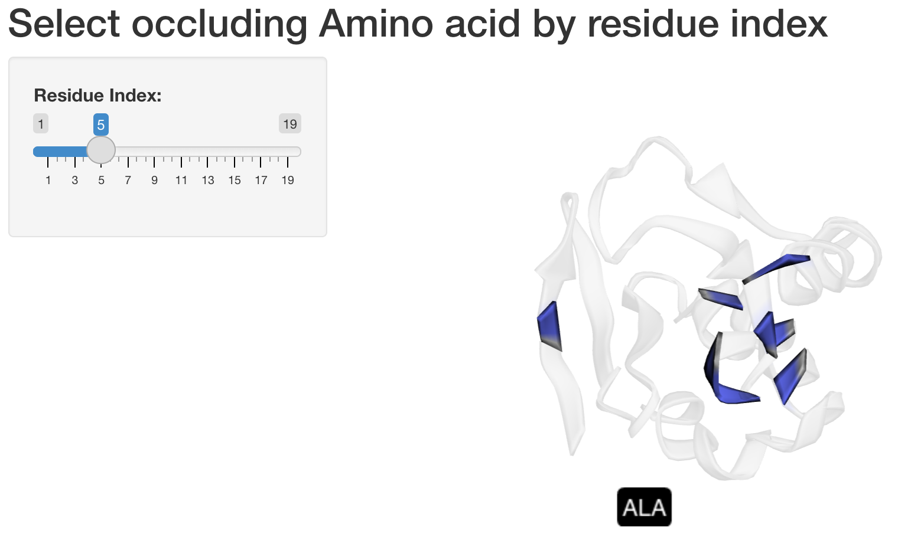
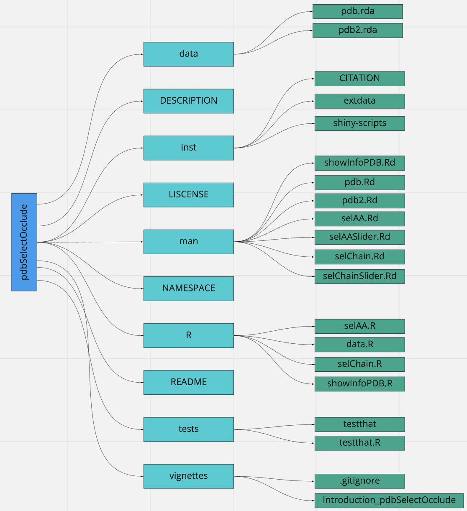
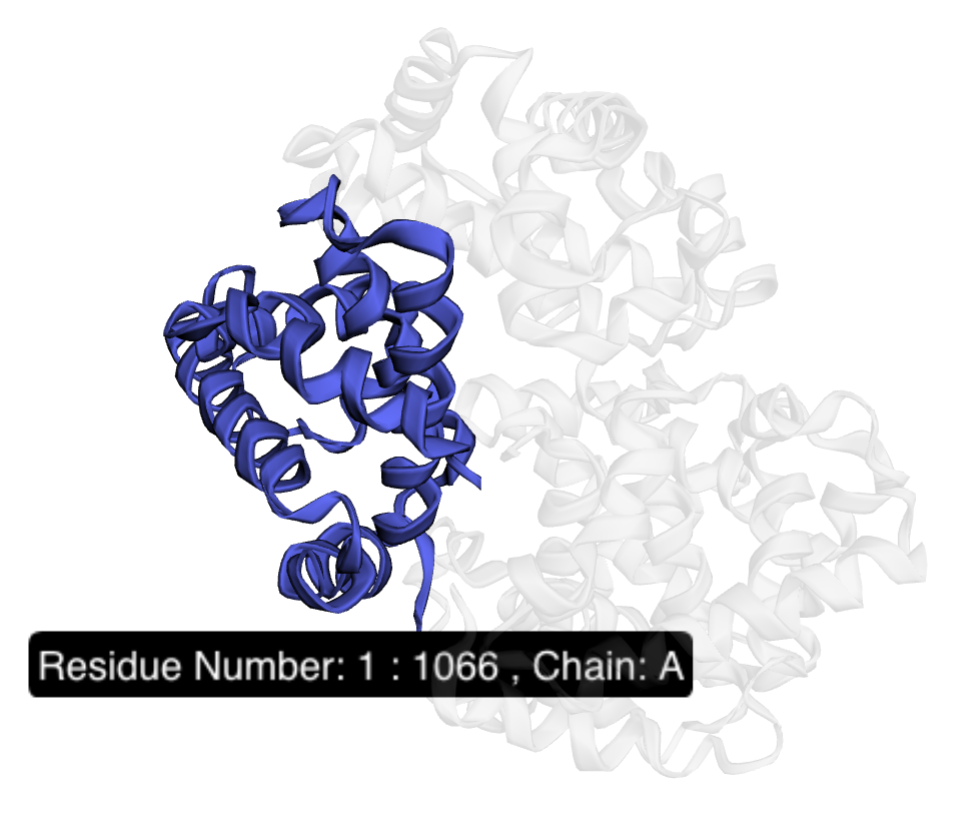

<!-- README.md is generated from README.Rmd. Please edit that file -->

```{r, include = FALSE}
knitr::opts_chunk$set(
  collapse = TRUE,
  comment = "#>",
  fig.path = "man/figures/README-",
  out.width = "100%"
)
```

# pdbSelectOcclude

<!-- badges: start -->
<!-- badges: end -->

## Description

`pdbSelectOcclude` is an R package for visualizing relationships between protein structural and non-spatial data, and for selecting occluding structures in a 3D molecular visualization environment. The objective of the package is to help improve current selecting (aka brushing) protein structural residues techniques. Currently, most brushing techniques (such as point-and-click) for 3D spatial data do not work well for occluded structures (i.e. molecular structures that are not visible from the surface). The package is targeted for those who are interested in molecular visualization.

This includes the main components: DESCRIPTION, NAMESPACE, man subdirectory and R subdirectory. Additionally, licence, README and subdirectories vignettes, tests, data and inst are also explored. To develop this package, R (version 4.0.2) and Mac platform was used. 

## Installation 

You can install the development version of pdbSelectOcclude like so:

``` r
require("devtools")
devtools::install_github("JerrieFeng/pdbSelectOcclude", build_vignettes = TRUE)
library("pdbSelectOcclude")
```

To run the Shiny App:
``` r
#Example of visualizing occluded AA
selAASlider(pdb, "1bm8")

#Example of visualizing occluded protein chains
selChainSlider(pdb2, "1SI4")
```




## Overview

``` r
ls("package:pdbSelectOcclude")
data(package = "pdbSelectOcclude") # includes PDB files
```

`pdbSelectOcclude` contains 5 functions. The *showInfoPDB* function takes a PDB 
file as input, and then returns the AA (amino acid) and chain information of the
chosen protein. *selAA* function allow users to select an [occluded] AA to view
and interact with. *selAASlider* function allow users to interact with any AA 
with a slider through Shiny App. *selChain* function allow users to select an 
[occluded] chain to view and interact with. *selChainSlider* function allow users
to interact with any chain with a slider through Shiny App.

An overview of the package and examples of what it should produce is illustrated below.





``` r
browseVignettes("pdbSelectOcclude")
```

## Contributions

The author of the package is Jerrie Feng. 
All the functions rely on `bio3d` package to read and extract information from the 
PDB files. *selAA* and *selChain* makes use of `r3dmol` and `dplyr` to visualize the
protein as a 3D molecule. *selAASlider* and *selChainSlider* make use of Shiny to
create the slider and allow users to interact with the proteins. 

## References

Chang, W, et al. (2017). Using sliders. Shiny from Rstudio. https://shiny.rstudio.com/articles/sliders.html.

Chang, W, et al. (2021). shiny: Web Application Framework for R. R package version 1.7.1. https://CRAN.R-project.org/package=shiny.

Skjaerven, L., Yao X.Q., Grant B.J. (2006). Getting started with Bio3D. Grant Lab: ComputationalBiophysics & Bioinformatics.  http://thegrantlab.org/bio3d/articles/online/intro_vignette/Bio3D_introduction.html#references-1.

Skjaerven, L., Yao X.Q., Grant B.J. (2020). chain.pdb: Find Possible PDB Chain Breaks.
bio3D. https://rdrr.io/cran/bio3d/man/chain.pdb.html.

Su, W., Johnston, B. (2021). r3dmol: Create Interactive 3D Visualizations of Molecular Data. Github.https://github.com/swsoyee/r3dmol.

Su, W., Johnston, B. (2021). r3dmol-shiny: Shiny bindings for r3dmol. https://rdrr.io/cran/r3dmol/man/r3dmol-shiny.html. 


## Acknowledgements

This  package  was  developed  as  part  of  an  assessment  for  2021  BCB410H:  Applied  Bioinfor-matics, University of Toronto, Toronto, CANADA.

